# Microsoft Teams Integration Strategy for the Financial Data Agent

## Context

The Financial Data Agent is an existing Text-to-SQL service over a data warehouse, exposed as a REST API. The goal is to let users access it through Microsoft Teams as a conversational bot — ask financial questions in chat and receive structured data results. This is the first entry point before later adding Outlook integration.

> **Naming note.** Throughout this repo the Azure resources, code symbols, env
> vars, and the GitHub repo all carry the historical code name **Data Assistant**
> (resource group `rg-data-assistant-dev`, Azure Bot `data-assistant-teams-bot-dev`,
> class `DataAssistantBot`, env vars `DATA_AGENT_API_BASE_URL` / `DATA_AGENT_API_KEY`, etc.).
> They are kept verbatim so the running demo doesn't break. The user-facing
> Teams app is branded **Data Assistant** (see `appPackage/manifest.json`).

**Delivery model:** This is a **reusable accelerator/template**. We prototype in our Azure subscription, then share the repo with customers who deploy it independently into their own Azure subscription, pointing to their own Financial Data Agent API instance.

```
OUR REPO (prototype)                 CUSTOMER (their deployment)
├── Bot application code             ├── Clone/fork the repo
├── Parameterized Bicep IaC          ├── Fill in .env with their values
├── Manifest with ${{}} placeholders ├── Run `atk provision` in THEIR Azure sub
├── Setup documentation              ├── Register bot in THEIR Entra ID
└── Example env files (.env.example) ├── Connect to THEIR Data Agent API
                                     └── Publish to THEIR Teams app catalog
```

**Critical platform note:** Microsoft Bot Framework SDK v4 was archived December 31, 2025. New development must use either the **Microsoft 365 Agents SDK** or **Teams SDK v2** (formerly Teams AI Library). The companion tooling rebranded to **Microsoft 365 Agents Toolkit** (formerly Teams Toolkit).

---

## 1. Three Framework Approaches

### A. Microsoft 365 Agents SDK (Node.js)

The direct successor to Bot Framework SDK v4. Same conceptual model (Activity, TurnContext, Adapter) with modernized packages.

**Key packages:**
- `@microsoft/agents-activity` (replaces `botframework-schema`)
- `@microsoft/agents-hosting` (replaces `botbuilder`)
- `@microsoft/agents-hosting-extensions-teams` (Teams overrides)
- `@microsoft/agents-hosting-dialogs` (Waterfall/Component dialogs)
- `@microsoft/agents-authentication-msal`

**How it connects to the Data Agent API:**
- Inside `onMessage` handler, extract user text, call the Data Agent REST API via HTTP client, send typing indicator while waiting, format response as Adaptive Card

**Pros:**
- Full control over conversation logic, middleware pipeline, state
- Multi-channel capability (Teams, Web Chat, Email, SMS) from one codebase
- Proactive messaging, rich dialog management
- Actively maintained

**Cons:**
- More boilerplate — you wire everything manually
- Requires explicit Azure Bot resource provisioning and manifest authoring
- No built-in AI orchestration
- Steeper learning curve

**Best for:** Bots needing multi-channel reach beyond just Teams, or complex dialog trees.

---

### B. Teams SDK v2 (Teams AI Library) + Microsoft 365 Agents Toolkit

A Teams-first SDK with higher-level abstractions: built-in action planner, conversation history management, prompt management. The Agents Toolkit (VS Code extension + CLI) scaffolds everything.

**What the Toolkit scaffolds:**
- `appPackage/` — manifest.json + icons
- `infra/` — Bicep templates (Azure Bot, App Service)
- `env/` — environment configs (.env.dev, .env.staging, .env.prod)
- `index.ts` — Express server entry point
- `teamsBot.ts` — bot logic handler
- `adaptiveCards/` — card templates
- `m365agents.yml` — provisioning/deployment config

**Key packages:**
- `@microsoft/teams-ai`
- `@microsoft/agents-hosting` (underlying layer)
- Agents Toolkit CLI: `@microsoft/m365agentstoolkit-cli`

**Pros:**
- Fastest path to working Teams bot — scaffolds everything including Azure provisioning
- One-click F5 debug with Dev Tunnels
- Built-in SSO scaffolding (dramatically reduces auth boilerplate)
- Conversation history and state management handled by SDK
- Typing indicators, streaming responses, suggested actions built in
- Microsoft 365 Agents Playground for local testing without Teams tenant

**Cons:**
- Opinionated project structure
- Teams-first; less suited for non-Teams channels
- v2 is relatively new — fewer community examples than Bot Framework v4

**Best for:** Teams-first bots that need to reach production quickly.

---

### C. Custom Webhook (Outgoing / Incoming / Power Automate)

**Outgoing Webhook:** Teams POSTs to your endpoint when users @mention it in a channel. You respond with text/card.

**Hard limitations that disqualify it for the Financial Data Agent:**
- Channel-only (no 1:1 chat)
- Must be @mentioned every message
- No proactive messaging
- No SSO or auth flow
- No conversation state
- Must respond within 10 seconds (Data Agent can take 10-30s)
- No card actions beyond `openURL`
- Scoped to a single team

**Incoming Webhook:** Push-only (you send cards to Teams, can't receive messages).

**Best for:** Simple notifications. **Not suitable for a conversational financial data agent.**

---

## 2. Architecture Design (As Built)

### Component Diagram

```
Teams Client (Desktop/Mobile/Web)
    |  HTTPS (TLS 1.2+)
    v
Azure Bot Service (channel registration, message routing)
    |  Activity Protocol
    v
Bot Application (Express/Node.js on Azure Container Apps)
    |-- @microsoft/agents-hosting (message handling, middleware, cards)
    |-- Stateless single-turn request policy
    |  HTTPS
    v
Financial Data Agent REST API (augmentation → dataset → table → join → column → entity → SQL → dry_run → finalize)
    |
    v
data warehouse → Query Results → Adaptive Card → Teams Client
```

### Reference Demo Deployment

This repository ships a reference deployment running on **Azure Container Apps**.
App Service was the original target in `infra/main.bicep`, but constrained dev
subscriptions can hit `VM quota = 0` and the F1 free tier on Linux is prone to
container startup timeouts. Container Apps avoids both issues (different
compute pool, real CPU, no zip-extraction quirks).

```
Microsoft Teams client (InPrivate browser session)
    |  HTTPS, msteams channel
    v
Bot Framework Service  (smba.trafficmanager.net/amer/<tenantId>/)
    |  Bot Connector REST (signed by App Reg's secret)
    v
Azure Bot resource: data-assistant-teams-bot-dev   (SingleTenant, MsTeams channel on)
    |   endpoint -> https://data-assistant-app.<env-domain>.centralus.azurecontainerapps.io/api/messages
    v
+-----------------------------------------------------------------------------+
| Azure Container Apps environment: data-assistant-env  (centralus)                   |
|                                                                             |
|   data-assistant-app  (Container App, min/max replicas = 1, 0.5 vCPU / 1 GiB)       |
|     image: <your-acr-name>.azurecr.io/data-assistant:v1                           |
|     env: BOT_ID, tenantId, USE_MOCK_CLIENT=true, DISABLE_AUTH=false,        |
|          PERSONAL_CHAT_ONLY_ENABLED=true                                    |
|     secret: BOT_PASSWORD (Container Apps secret, secretref pattern)         |
|                                                                             |
|   DataAssistantBot (Node 22 / Express / @microsoft/agents-hosting 1.5.2)           |
|     - JWT middleware validates BFS tokens (DISABLE_AUTH=false in cloud)     |
|     - personalChatOnlyMiddleware: blocks group/channel before backend call  |
|     - auditMiddleware + rateLimitMiddleware                                 |
|     - mock Data Agent client (in-process) returns canned FY25 Q1 data       |
|     - bot.run -> DataAssistantBot.onMessage -> Adaptive Card response              |
|                                                                             |
+-----------------------------------------------------------------------------+

Identity plane (Microsoft Entra)
    Tenant:          <your-tenant>.onmicrosoft.com  (e.g. an M365 Developer Program sandbox)
    App reg + SP:    <your-bot-id>  ("Data Assistant Teams Bot Dev")
    Bot user (test): <admin-test-user>@<your-tenant>.onmicrosoft.com

Container registry
    <your-acr-name>.azurecr.io   (Basic SKU, admin enabled for simple cred-based pull)

Resource group: rg-data-assistant-dev   (Azure sub: <your-subscription>)
```

**Key differences from the original recommended setup above:**

| Concern | Original recommendation | What we shipped | Why |
|---|---|---|---|
| Compute | App Service B1 | Container Apps (Consumption) | Constrained dev sub had VM quota 0; Container Apps uses a different quota pool |
| Data Agent API | Real Data Agent REST endpoint | In-process mock (`USE_MOCK_CLIENT=true`) | Demo doesn't need real backend data store; mock returns canned FY25 Q1 numbers |
| Bot tenant type | MultiTenant | SingleTenant (`AzureADMyOrg`) | Azure deprecated MultiTenant bot creation in 2025 |
| Local dev loop | F5 + dev tunnels | Same (dev tunnel + `npm run dev:teams`) | Unchanged; cloud deploy is for shared/customer testing |
| Cross-tenant use | Implicit (MultiTenant) | Deferred to UAMI rollout | SingleTenant covers all current test scenarios |

**Tech stack (as-built):**

| Layer | Choice | Version |
|---|---|---|
| Bot SDK | `@microsoft/agents-hosting` (Microsoft 365 Agents SDK — Approach A above, not B) | `^1.5.2` |
| HTTP server | Express | `^4.18.2` |
| HTTP client | axios | `^1.7.0` |
| Auth helpers | `@azure/identity`, `@azure/core-auth` | `^4.13.1`, `^1.10.1` |
| Observability | OpenTelemetry SDK + Azure Monitor exporter | `@opentelemetry/sdk-node ^0.218.0` |
| Adaptive Cards | v1.5 schema | — |
| Language | TypeScript | `^5.4.0` |
| Runtime (container) | Node | 22 LTS (alpine) |
| Tests | Jest + ts-jest | `^29.7.0` |
| Container image base | `node:22-alpine` | — |
| Registry | Azure Container Registry (Basic SKU) | — |
| Compute | Azure Container Apps (Consumption, `min-replicas=1`) | — |
| Channel registration | `Microsoft.BotService/botServices` (SingleTenant, MsTeams + Web Chat + Direct Line) | api-version `2022-09-15` |

A reader who only wants the demo running can read this stack and the diagram
above and reproduce everything end-to-end without touching the original
"Approach B / Teams SDK v2" write-up at the top of this document.

### Message Flow (Current Runtime)

```mermaid
flowchart LR
    U["Teams User"] --> T["Teams Client"]
    T --> BFS["Bot Framework Service"]
    BFS --> BOT["/api/messages on data-assistant-app<br/>Azure Container Apps"]
    BOT --> JWT["JWT validation via authorizeJWT<br/>DISABLE_AUTH=false in cloud"]
    JWT --> MW["Middleware chain<br/>PCO guard, audit, rate limit"]
    MW --> MSG["onMessage handler"]
    MSG --> TYP["Send typing activity"]
    TYP --> Q["Build single-turn query<br/>(remove mention + userContext)"]
    Q --> CLIENT{"USE_MOCK_CLIENT"}
    CLIENT -- true --> MOCK["MockDataAgentClient<br/>(in-process canned data)"]
    CLIENT -- false --> API["DataAgentClient POST /api/query<br/>X-Conversation-Context=single-turn<br/>X-History-Policy=none"]
    MOCK --> CARD["Build Adaptive Card<br/>(table/metrics/timeseries + SQL action + stateless footer)"]
    API --> CARD
    CARD --> RESP["Send card response"]
```



1. User sends a message in Teams; Bot Framework Service routes it to `/api/messages`.
2. Bot JWT is validated (cloud path), then middleware runs in order: **personal-chat-only guard**, audit, rate limiting. Non-personal Teams conversations are short-circuited before reaching the message handler.
3. Bot sends one typing activity immediately.
4. Bot builds a single-turn query from the current message and current activity metadata.
5. Bot uses in-process mock data when `USE_MOCK_CLIENT=true` (current demo), otherwise calls the Data Agent API.
6. Real API calls always include `X-Conversation-Context: single-turn` and `X-History-Policy: none`.
7. Bot renders an Adaptive Card response and returns it to Teams.

No ConversationState persistence, proactive queue, or background worker is used in the current runtime.

### Handling Long-Running Queries

Current behavior is synchronous only:

- Bot sends one typing activity at request start.
- `DataAgentClient` uses a 45s HTTP timeout to the Data Agent API.
- On timeout/failure, bot sends an error card.

Planned enhancement (not implemented): periodic typing refresh, async queue, and proactive completion delivery.

### Adaptive Card Patterns (Current)

| Data Type | Card Element |
|-----------|-------------|
| Tabular data (revenue by product) | `ColumnSet`-based table layout (Teams-safe), capped at first 10 rows |
| Summary metrics (total revenue, YoY) | `ColumnSet` with bold values, color-coded +/- |
| Time series / trends | Optional `Image` via `chartImageUrl` plus tabular series values |
| SQL transparency | `Action.ShowCard` showing generated SQL |
| Stateless indicator | Footer line on every success card: `Stateless` + "No conversation history sent to backend" |
| Error states | Attention-colored header + suggestion text list |

### Error Handling UX (Current)

| Scenario | Response |
|----------|----------|
| Data Agent API unreachable/timeout | Error card: "Trouble connecting to data service: <message>" |
| Unknown or unsupported query | Error card with suggestions list |
| No results from backend | Error card (backend-provided error/suggestions) |
| Non-personal Teams conversation (groupChat / channel) | "Personal chat only" block card from `personalChatOnlyMiddleware`; backend not called |

---

## 3. Deployment Strategy

### Local Development

Current local loop:

- Run Dev Tunnel for public ingress to local bot.
- Run `npm run dev:teams`.
- Keep Azure Bot messaging endpoint pointed at the Dev Tunnel URL.

### Azure Hosting

Current production-like demo hosting is Azure Container Apps.

| Option | Status in repo | Notes |
|--------|----------------|-------|
| Azure Container Apps | Current as-built runtime | Working deployment with `min-replicas=1` |
| App Service (Bicep) | Reference template only | `infra/main.bicep` retained, but not the active demo runtime |

### Environments

| Env | Purpose | Current Hosting |
|-----|---------|-----------------|
| local | Developer testing with Teams round-trip | localhost + Dev Tunnel |
| dev/demo | Shared validation and live Teams checks | Azure Container Apps |

Each environment still needs its own bot identity and endpoint configuration.

### CI/CD Reality

Current iteration path in this repo is git + build/test + image deploy:

```
git push -> npm run build -> npm test -> az acr build -> az containerapp update
```

The `atk provision` / `atk deploy` path remains a future/alternate workflow, not the active deployment path used by the current demo.

---

## 4. Key Technical Considerations

### Authentication (current)

1. Teams sends bot activity through Bot Framework Service.
2. Bot validates JWT via `authorizeJWT` when `DISABLE_AUTH=false`.
3. Bot uses bot credentials (`BOT_ID`, `BOT_PASSWORD`) for channel auth.
4. Optional user identity (`from.aadObjectId`) is passed to backend headers when using real API client.

No `signin/tokenExchange` or OBO flow is implemented in the current runtime.

### Security

- Never log raw query results (financial data is confidential)
- All communication TLS 1.2+
- Stateless policy is code-locked (`statelessPolicyEnabled=true`) and enforced on API headers
- Personal-chat-only enforcement at both manifest (`scopes: ["personal"]`) and runtime (`personalChatOnlyMiddleware`) layers
- Audit log: user identity, query text, timestamp, result row count, latency

### Rate Limits

- App-level per-user rate limiting is enforced in middleware.
- No request queue or background retry worker is implemented in current runtime.

### Observability

- Application Insights (auto-scaffolded by Toolkit): request traces, dependency calls to the Data Agent, exceptions
- Custom metrics: query latency by pipeline stage, success rate, dataset popularity, follow-up rate
- Alerts are documented in `docs/ALERTING.md`; active deployment wiring depends on target hosting/IaC path.

### App Manifest Structure

```json
{
  "bots": [{
    "botId": "${{BOT_ID}}",
    "scopes": ["personal"]
  }],
  "webApplicationInfo": {
    "id": "${{BOT_ID}}",
    "resource": "api://botid-${{BOT_ID}}"
  }
}
```

The `scopes` array is intentionally limited to `personal` only — see [Personal Chat Only Plan](PERSONAL_CHAT_ONLY_PLAN.md) for the rationale and runtime defense in depth.

Note: `${{}}` placeholders are resolved by the Agents Toolkit from env files at provision/deploy time — nothing is hardcoded.

Current repo packaging also supports manual placeholder replacement and sideload zip creation for direct Teams testing.

---

## 5. Accelerator Portability Design

This repo is still portability-first, but the documented "happy path" now follows the as-built Container Apps deployment.

### Zero Hardcoded Values

Runtime-specific values are externalized in env/config and app package placeholders.

| Variable | Purpose | Who sets it |
|----------|---------|-------------|
| `BOT_ID` | Bot app/client id used by adapter auth | Deployer |
| `BOT_PASSWORD` | Bot client secret | Deployer |
| `DATA_AGENT_API_BASE_URL` | Data Agent API base URL (when not using mock) | Deployer |
| `DATA_AGENT_API_KEY` | Optional API key for backend | Deployer |
| `USE_MOCK_CLIENT` | In-process mock vs real backend | Deployer |
| `PERSONAL_CHAT_ONLY_ENABLED` | Runtime guard for personal-only enforcement (default `true`) | Deployer |

### Current Repo Structure (relevant runtime paths)

```
src/index.ts                    # Express host, auth middleware, /api/messages and /api/health
src/bot.ts                      # onMessage pipeline, typing, client call, card reply
src/services/dataAgentClient.ts    # real backend client + stateless headers
src/services/mockDataAgentClient.ts# in-process demo responses and test triggers
src/cards/queryResultCard.ts    # Teams-safe table/metrics/timeseries card rendering
src/cards/personalChatOnlyCard.ts # block card sent when guard fires
src/middleware/personalChatOnlyMiddleware.ts # runtime guard (first in chain)
src/middleware/auditMiddleware.ts            # structured audit logging
src/middleware/rateLimitMiddleware.ts        # per-user request throttling
appPackage/manifest.json        # Teams manifest with placeholders (scopes: ["personal"])
infra/main.bicep                # App Service reference template (not active demo runtime)
docs/TESTING_REAL_TEAMS.md      # end-to-end runbook for real Teams validation
docs/PERSONAL_CHAT_ONLY_PLAN.md # PCO design, rollout, and verification log
```

### Customer Deployment Flow (current documented path)

```
1. Clone repo and install dependencies
2. Configure env values (bot identity + backend mode + PERSONAL_CHAT_ONLY_ENABLED)
3. Build and test (npm run build, npm test)
4. Build container image (az acr build)
5. Deploy/update Azure Container App (az containerapp create/update)
6. Point Azure Bot endpoint to /api/messages on deployed app
7. Sideload Teams app package and validate in personal scope only (group/team install is intentionally not offered)
```

### Portability Checklist

- No tenant/subscription IDs or secrets committed.
- Manifest uses placeholders for bot/app ids.
- Real backend endpoint is env-driven; mock mode is switchable.
- Stateless request policy is code-locked and visible via health + card footer.
- Docs in `README.md`, `docs/ARCHITECTURE.md`, and `docs/TESTING_REAL_TEAMS.md` are sufficient for end-to-end reproduction.

---

## 6. Recommendation and Next Steps

### Recommended now

Use the current as-built stack for demos and customer walkthroughs:

- Microsoft 365 Agents SDK (`@microsoft/agents-hosting`)
- Azure Container Apps
- In-process mock (`USE_MOCK_CLIENT=true`) or real Data Agent API (`USE_MOCK_CLIENT=false`)
- Stateless single-turn policy

### Planned enhancements (not yet implemented)

- OBO/token-exchange SSO integration to backend.
- Async long-running query flow (queue + proactive completion).
- Optional App Service parity path if quotas/standards require it.
- CSV export and broader analytics UX enhancements.
